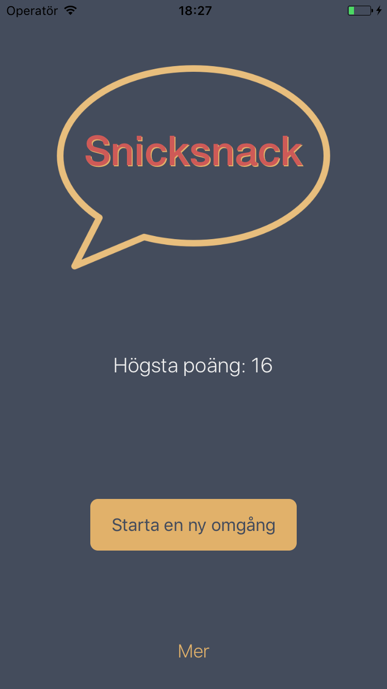
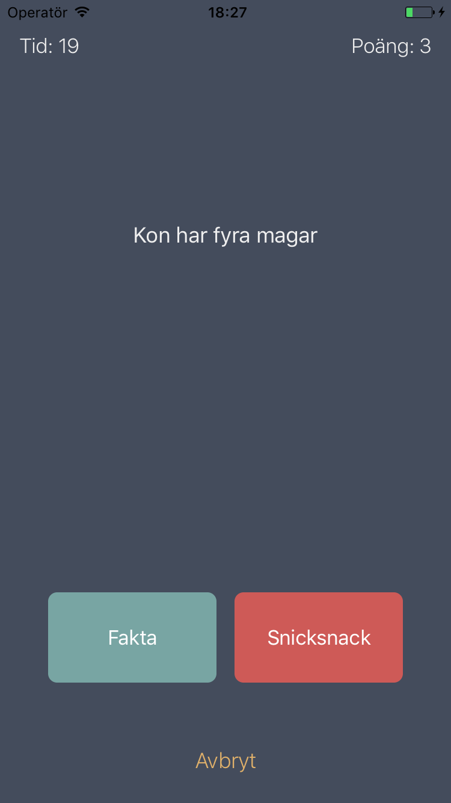

# Snicksnack

Ett enklare spel för iOS.
Spelet går ut på att avgöra om ett påstående är fakta eller snicksnack.
Svara rätt på så många påståenden som möjligt på 30 sekunder.
Appen är skriven i Swift 3 och använder NSUserDefaults för att spara highscore.

